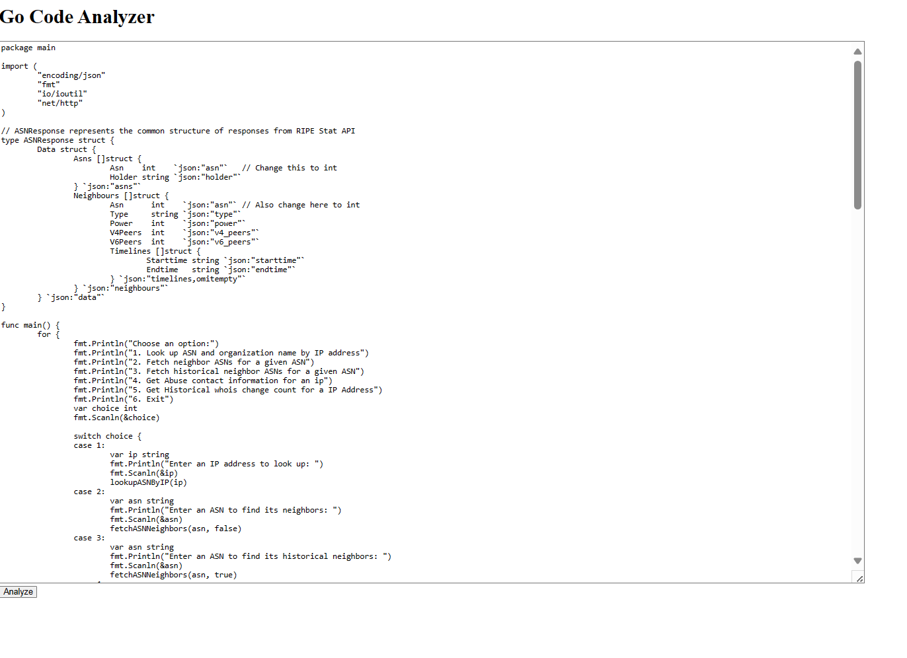
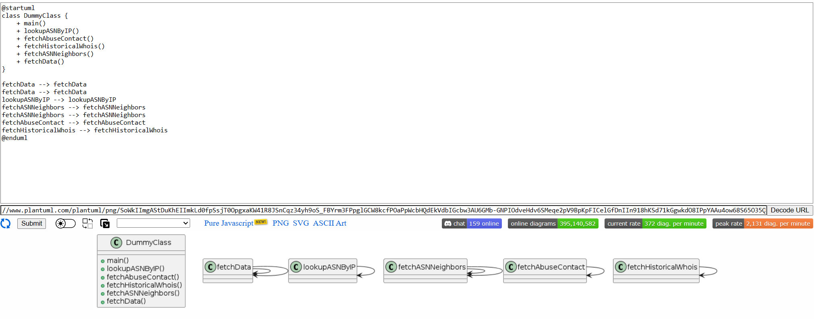
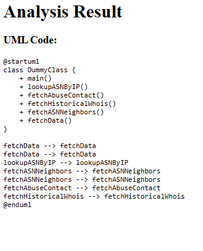

# Go Code Analyzer

This project is a web-based Go code analyzer that generates UML diagrams from pasted Go code. It uses Flask/Gunicorn for the web interface and Go for parsing the code and generating UML diagrams.

## Features

- Paste Go code into a web form and analyze it to generate UML diagrams.
- Display UML code in a formatted block.
- Copy the generated UML code to the clipboard.

## Requirements

- Docker
- Python 3.10
- Go 1.20

## Directory Structure

/project-directory
Dockerfile
go.mod
go.sum
main.go
requirements.txt
umlgo.py
/parser
parser.go
/templates
index.html
result.html


## Setup and Installation

### Using Docker

1. **Build the Docker image**:
    ```sh
    docker build -t umlgo-app .
    ```

2. **Run the Docker container**:
    ```sh
    docker run -p 8800:8800 umlgo-app
    ```

### Local Setup

1. **Clone the repository**:
    ```sh
    git clone https://github.com/yourusername/umlgo.git
    cd umlgo
    ```

2. **Set up a virtual environment**:

    On Windows:
    ```sh
    python -m venv umlgoenv
    umlgoenv\Scripts\activate
    ```

    On Unix or MacOS:
    ```sh
    python3 -m venv umlgoenv
    source umlgoenv/bin/activate
    ```

3. **Install the dependencies**:
    ```sh
    pip install -r requirements.txt
    ```

4. **Run the Flask application**:
    ```sh
    gunicorn -w 4 -b 0.0.0.0:8800 umlgo:app
    ```

## Usage

1. Open your web browser and navigate to `http://localhost:8800`.
2. Paste your Go code into the input box and click the "Analyze" button.
3. The generated UML code will be displayed on the result page.
4. You can copy the UML code to the clipboard using the "Copy to Clipboard" button.

## Development

### Go Code Parser

- The Go code parser is located in the `parser` directory. It consists of `parser.go` which contains the logic for parsing Go code and generating UML diagrams.
- The `main.go` file is used to run the parser.

### Flask Application

- The Flask application is defined in `umlgo.py`.
- HTML templates are located in the `templates` directory.

## Contributing

Contributions are welcome! Please open an issue or submit a pull request for any bugs or improvements.


Input example:



UML Output example:


Tool Output:

